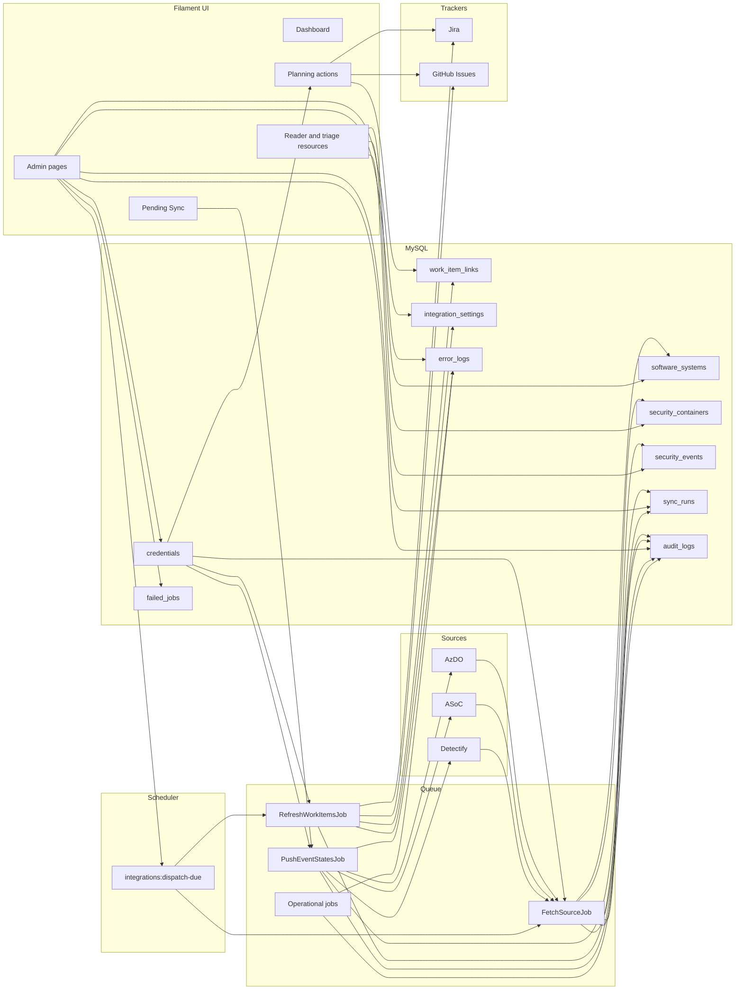

# AppSec Scout — Architecture

This document describes the implemented Laravel architecture through M6.

## High-Level Flow

## Runtime Topology

The local and production-style runtime is a single `app` image plus MySQL and Redis in Compose.

Inside the `app` container, Supervisor runs:

- nginx
- php-fpm
- `php artisan schedule:work`
- `php artisan queue:work`

The app container is hardened to run as `www-data` with:

- read-only root filesystem
- all Linux capabilities dropped
- writable storage volume and tmpfs runtime paths

## Data Ownership

AppSec Scout is the system of record for operator edits.

- source fetch jobs read upstream systems into local tables
- triage and planning actions update only the local database
- Sync role actions are the only flows that write alert state or comments back to upstream sources
- tracker refresh updates local work-item metadata only

## Credentials

Credential storage is centralized in the `credentials` table.

Resolution model:

1. explicit preferred user
2. current authenticated user
3. integration service user
4. system credential

This supports both interactive user actions and scheduled background jobs.

## Deferred Scope

Defender for Cloud is intentionally deferred from M6 and is not represented in the supported runtime paths documented here.