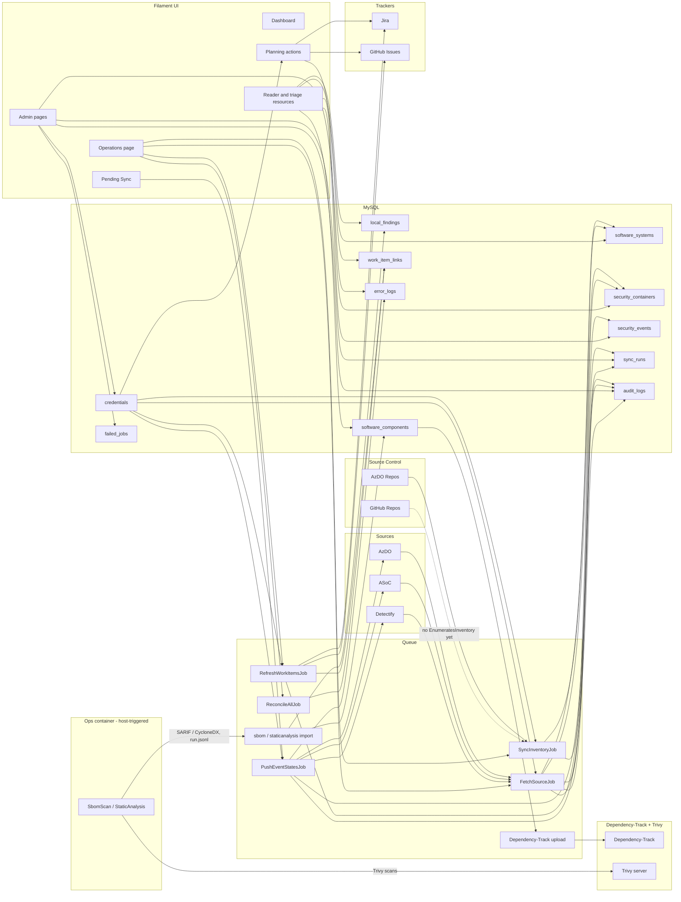

# AppSec Scout — Architecture

This document describes the implemented Laravel architecture: the runtime topology, the data
flow between upstream integrations and the local database, and the credential model that ties
them together.

## High-Level Flow

## Runtime Topology

The default Compose stack (`docker-compose.yml`, no profile needed) starts these services:

| Service | Image | Role |
| --- | --- | --- |
| `app` | `appsec-scout:latest` | Laravel app: nginx + php-fpm + scheduler + queue worker, run under Supervisor |
| `mysql` | `mysql:8.0` | Primary database |
| `redis` | `redis:7-alpine` | Cache, queue, and session backend |
| `dependencytrack-postgres` | `postgres:16-alpine` | Dependency-Track's own database |
| `dependencytrack-cacerts-init` | `dependencytrack/apiserver` | One-shot: merges any corporate CA into a shared truststore volume for the API server |
| `dependencytrack-apiserver` | `dependencytrack/apiserver` | Dependency-Track API |
| `dependencytrack-frontend` | `dependencytrack/frontend` | Dependency-Track UI |
| `trivy-token-init` | `appsec-scout:latest` | One-shot: generates the shared token `trivy-server` and `dependencytrack-bootstrap` use to authenticate to each other |
| `trivy-server` | `aquasec/trivy:latest` | Self-hosted vulnerability database server, used by Dependency-Track's Trivy analyzer and by the SbomScan/StaticAnalysis workflows (see [docs/concepts/sbom-and-static-analysis.md](concepts/sbom-and-static-analysis.md)) |
| `dependencytrack-bootstrap` | `appsec-scout:latest` | One-shot: provisions a Dependency-Track team, API key, and Trivy analyzer config, storing the API key in the credential vault |

`node` (profile `tools`) and `ops` (profile `ops`) are opt-in and not started by a plain
`docker compose up` — see [docs/operations.md](operations.md) for when to use them.

Inside the `app` container, Supervisor runs `nginx`, `php-fpm`, `php artisan schedule:work`, and
`php artisan queue:work` (see `docker/supervisord.conf` for the exact flags).

The `app` and `dependencytrack-bootstrap` services run as `www-data` with a read-only root
filesystem, all Linux capabilities dropped, and writable storage volumes plus tmpfs-backed
runtime paths.

## Data Ownership

AppSec Scout is the system of record for operator edits.

- Source fetch jobs and inventory syncs read upstream systems/repositories into local tables.
- Triage and planning actions update only the local database.
- Sync-role actions are the only flows that write alert state, severity, or comments back to a
  Source.
- Tracker refresh updates local work-item metadata only.
- SbomScan/StaticAnalysis and their import commands are the equivalent read path for Local
  Findings and Dependencies — see [docs/concepts/sbom-and-static-analysis.md](concepts/sbom-and-static-analysis.md).

## Credentials

Credential storage is centralized in the `credentials` table, encrypted at rest.

There are exactly two credential-resolution flows:

- **System-triggered operations** (scheduled sync, background jobs, bulk Ops-page actions such as
  "Reconcile all tracker links") resolve the system credential (`owner_user_id IS NULL`, set via
  `Admin -> System Credentials`, `Vault::runAsOwner(null, ...)`).
- **User-triggered interactive actions** (creating/linking a work item, the per-alert "Find
  existing work items" action) resolve that specific user's own personal credential (set via
  `Profile -> Integrations`, `Vault::runAsOwner($operatorUserId, ...)`).

Which flow applies is fixed by the kind of operation. A missing required credential fails with a
clear error.

## Related Documents

- [docs/concepts/integration.md](concepts/integration.md) — the scheduling/dispatch mechanics for
  Source and Tracker sync.
- [docs/concepts/sources-trackers-source-control.md](concepts/sources-trackers-source-control.md) —
  what each Source/Tracker/Source Control role is, independent of scheduling.
- [docs/concepts/asset-system-container-alert.md](concepts/asset-system-container-alert.md) — the
  entity hierarchy this architecture populates.
- [docs/concepts/sbom-and-static-analysis.md](concepts/sbom-and-static-analysis.md) — the
  host-triggered SBOM/static-analysis pipeline and the Dependency-Track integration.
- [docs/install.md](install.md), [docs/operations.md](operations.md), [docs/security.md](security.md)
  — install, day-2 operations, and security posture.

## Out of Scope

Defender for Cloud > DevOps is specified as a planned Source but has no runtime code — see
[docs/concepts/sources-trackers-source-control.md](concepts/sources-trackers-source-control.md#supported-vs-deferred).
