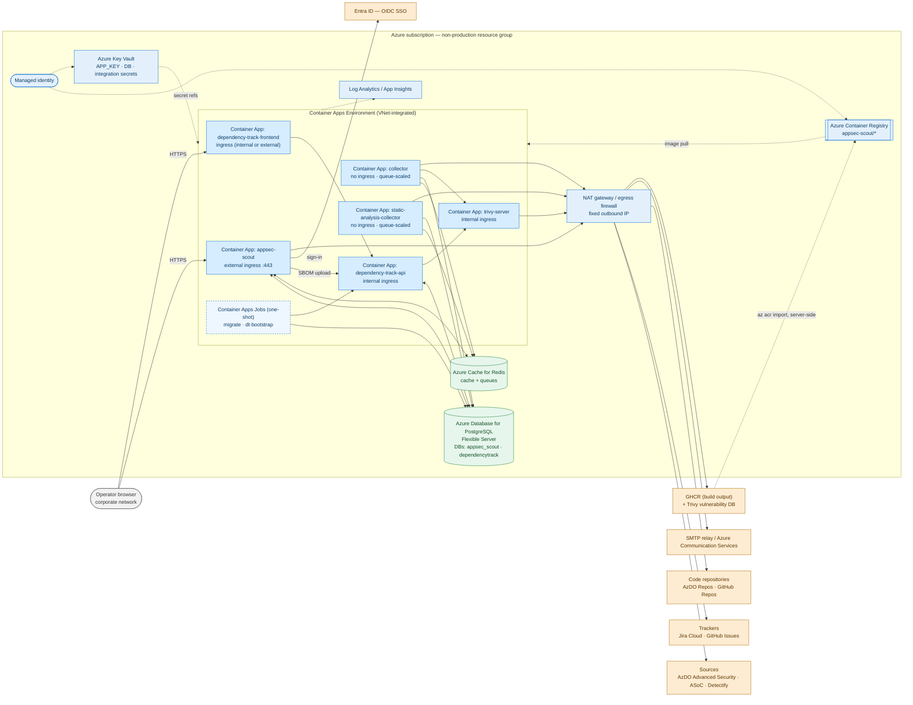

# AppSec Scout — Azure Cloud Architecture

Higher-level companion to [docs/architecture.md](architecture.md). That document describes the
full Compose stack and what runs *inside* each container; this one describes how the same
application maps onto Azure resources, and the ingress/egress the hosting team has to provision.

## Scope

This is the target shape for a **non-production but real** Azure environment (not the local
Docker Compose stack, and not a sandbox subscription).

Differences from the Compose topology:

- **One PostgreSQL Flexible Server** hosts both databases (`appsec_scout` and `dependencytrack`).
  There is no MySQL, and no separate Dependency-Track database server.
- **No `node` and no `ops` containers.** Both are workstation-side developer/operator profiles
  (`profiles: tools` / `profiles: ops`) and are never deployed.
- The one-shot init containers (`migrate`, `dependencytrack-bootstrap`) become **Container Apps
  Jobs** rather than boot-time work. The app runs with `APP_IMMUTABLE_BOOT=1`, so it never
  generates a key, runs migrations, or mutates itself at start — see
  [docs/install.md](install.md#cloud--immutable-boot).
- **No shared file storage is required.** Attachments live in the database; the collector and
  static-analysis workspaces are ephemeral scratch inside the replica.

## Resource Map

Blue = hosted in Azure, green = Azure data services, orange = external services AppSec Scout
**uses** but does not host.

## Components to Provision

| Resource | Purpose | Notes |
| --- | --- | --- |
| Azure Container Registry | Holds the deployable images | Receives images by server-side `az acr import` from GHCR — never rebuilt for Azure |
| Container Apps Environment | Runs every workload | VNet-integrated |
| Container App `appsec-scout` | Laravel/Filament application | The only mandatory public ingress; stateless, `APP_IMMUTABLE_BOOT=1` |
| Container App `collector` | Repository collection worker | No ingress; scales on the `repository-collection` queue |
| Container App `static-analysis-collector` | Static analysis worker | No ingress; scales on the `static-analysis` queue; heaviest CPU/memory profile |
| Container App `dependency-track-api` | Dependency-Track API | Internal ingress; JVM, needs the largest memory allocation |
| Container App `dependency-track-frontend` | Dependency-Track UI | Can be internal-only |
| Container App `trivy-server` | Self-hosted vulnerability database server | Internal ingress |
| Container Apps Jobs | `migrate`, `dt-bootstrap` | One-shot, run on deploy |
| PostgreSQL Flexible Server | System of record + sessions, and Dependency-Track's database | Two databases on one server |
| Azure Cache for Redis | Cache and job queues | Sessions live in PostgreSQL, not Redis |
| Key Vault | `APP_KEY`, DB credentials, integration secrets | Referenced as Container Apps secrets |
| Managed identity | ACR pull, Key Vault read | No registry or vault passwords in configuration |
| Log Analytics / App Insights | Container logs and telemetry | |
| NAT gateway / egress firewall | Deterministic outbound IP | Simplifies allowlisting on the upstream side |

## Ingress

- Exactly **one mandatory public entry point**: the `appsec-scout` app over HTTPS (managed FQDN
  or custom domain; WAF / Front Door optional).
- The Dependency-Track frontend is a second, optional entry point and may stay internal.
- Everything else is intra-environment traffic only.
- Behind a TLS-terminating proxy or ingress, the app must be configured with `TRUSTED_PROXIES`,
  `APP_FORCE_HTTPS=true`, and `SESSION_SECURE_COOKIE=true` — see
  [docs/install.md](install.md#running-behind-a-reverse-proxy).

## Egress

| Destination | From | Purpose |
| --- | --- | --- |
| Azure DevOps Advanced Security, AppScan on Cloud, Detectify | app | Read alerts; write state and comments back |
| Jira Cloud, GitHub Issues | app | Create and refresh work items |
| Azure DevOps Repos, GitHub Repos | collector, static-analysis-collector | `git clone` for SBOM scanning and static analysis |
| `ghcr.io` | trivy-server | Trivy vulnerability database refresh |
| SMTP relay | app | Password-reset mail |
| Entra ID | app | Optional OIDC SSO |

The Trivy vulnerability database is distributed through `ghcr.io`; corporate egress filtering
that blocks GHCR (e.g. Netskope) breaks the refresh, so it must be allowed explicitly from the
Container Apps environment.

## Secrets and Key Management

`APP_KEY` is the crown jewel: every credential in the vault and every user's TOTP secret is
encrypted with it. It must be supplied through the container environment from Key Vault —
immutable boot refuses to start without it and never generates one. Losing it means re-entering
all integration credentials and re-enrolling every user's 2FA. Rotation is supported through
`APP_PREVIOUS_KEYS`.

## Image Supply Chain

CI builds the three deployable images, gates each on a Trivy scan (fixable HIGH/CRITICAL blocks
the push), and publishes them to GHCR (`.github/workflows/image-publish.yml`).
`.github/workflows/acr-promote.yml` then imports a chosen tag into ACR server-side with
`az acr import` — the exact bytes that were scanned, never a rebuild. Its header lists the Azure
prerequisites: the ACR instance, an app registration with a federated credential for GitHub
OIDC, the `AcrPush` role on the registry, and four repository variables.

## Related Documents

- [docs/architecture.md](architecture.md) — full container-level topology
- [docs/install.md](install.md) — installation, immutable boot, reverse proxy, prebuilt images
- [docs/security.md](security.md) — authentication, authorization, credential handling
